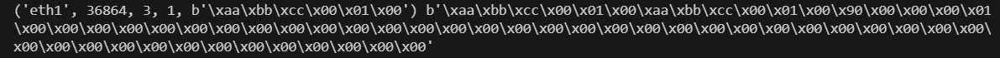
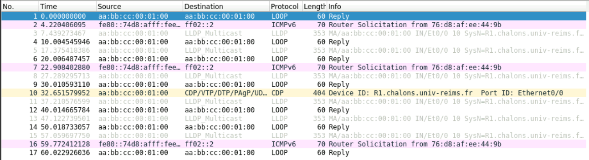
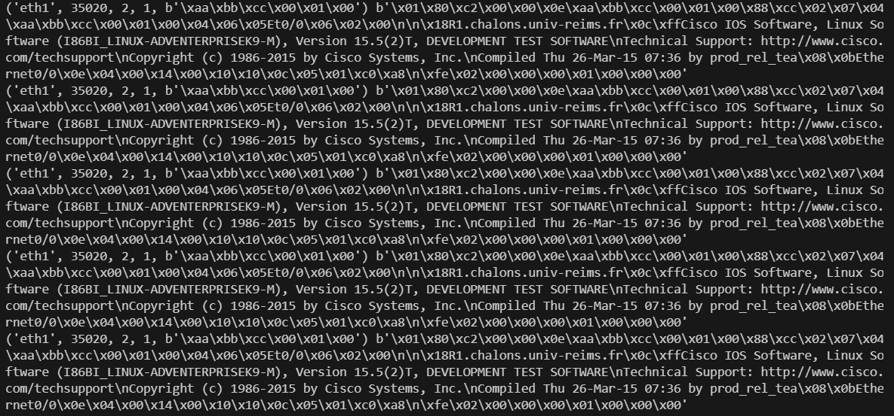
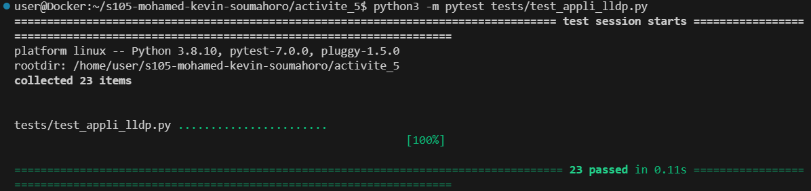
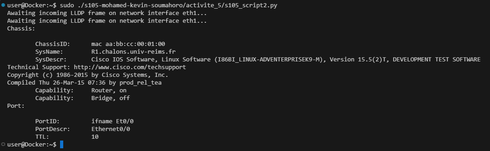

<p >
    
    
</p>   

<h1 align="center"> ACTIVITE 5 </h1>
<h2 align="center"> SAE R105 : Récupération et traitement des trames d’annonces LLDP en Python  </h2><br>


## Présentation

_Nous avons étudié dans l’activité 4 **Implémentation de LLDP en Python** comment construire et émettre une trame d’annonce LLDP sur un réseau connecté. Nous avons utilisé un socket de la famille `socket.AF_PACKET` du type `socket.SOCK_RAW` pour initialiser un socket BSD bas niveau qui accède directement à la couche 2 du modèle OSI (Liaison de données – data-link) capable de traiter des paquets bruts incluant tout type d’entête Ethernet._

_Nous l’avons lié à l’interface réseau « `eth1` » grace à sa méthode `bind` pour qu’il puisse émettre des trames vers le routeur R1 de la topologie étudiée._

source :  _**Ennoncé SAE 103 → Récupération et traitement des trames d’annonces LLDP en Python**_

### 🛠️ Tâche 1 → Script de réception d’une trame éthernet
création du script Python `s105_script2.py` qui va réceptionner une trame éthernet et l’afficher.
```bash
$ touch s105_script2.py
```
Edition du script Python `s105_script2.py` en insérant la partie script précédente pour réceptionner une trame, et affichage des valeurs reçues.
Après avoir edité le script python `s105_script2.py` on obtient comme programme : 

```python
def receive_lldp_frame(interface='eth1'):
    """
    Fonction qui écoute sur une interface donnée et retourne une trame LLDP reçue.
    """
    # Créer un socket raw pour recevoir les paquets réseau

    sock = socket.socket(socket.AF_PACKET, socket.SOCK_RAW, socket.ntohs(0x0003))
    sock.bind((interface, 0))  # Replace with your interface name
    # print(f"Awaiting incoming LLDP frame on network interface {interface}...")
    # Receive packets, the size of the buffer receiving the datas is 65535 bytes
    raw_data, addr = sock.recvfrom(65535)
    print(addr, raw_data)
```


On observe premierement après execution un tuple et une donnée brute composé de :
* `eth1` : l’interface de réception
* `36864` : le type éthernet de la trame
* `3` : le type d’adresse
* `1` : l’index du périphérique
* `b'\xaa\xbb\xcc\x00\x01\x00` : l’adresse du périphérique
* `b'\xaa\xbb\xcc\x00\x01\x00\xaa\xbb\xcc\x00\x01\x00\x90\x00\x00\x00\x01\x00\x00\x00\x00\x00\x00\x00\x00\x00\x00\x00\x00\x00\x00\x00\x00\x00\x00\x00\x00\x00\x00\x00\x00\x00\x00\x00\x00\x00\x00\x00\x00\x00\x00\x00\x00\x00\x00\x00\x00\x00\x00\x00'` : Représente la trame capturée en elle-même


### 🛠️ Tache 2 → Boucle de réception de trames éthernets

Après avoir edité le programme `s105_script2.py` on a :

```python
def receive_lldp_frame(interface='eth1'):
    """
    Fonction qui écoute sur une interface donnée et retourne une trame LLDP reçue.
    """
    # Créer un socket raw pour recevoir les paquets réseau

    # DEBUT TACHE 2
    start = datetime.now()
    duration = timedelta(seconds=60)
    while datetime.now() - start < duration:
    #     # Create a raw socket using AF_PACKET
        sock = socket.socket(socket.AF_PACKET, socket.SOCK_RAW, socket.ntohs(0x0003))
        sock.bind((interface, 0))  # Replace with your interface name
        # print(f"Awaiting incoming LLDP frame on network interface {interface}...")
        # Receive packets, the size of the buffer receiving the datas is 65535 bytes
        raw_data, addr = sock.recvfrom(65535)
        print(addr, raw_data)
        sock.close() 
```
Apres execution de ce script, on a reçu sur l'interface `eth1` de notre machine hôte en **CLI**.

```bash
user@Docker:~/s105-mohamed-kevin-soumahoro/activite_5$ sudo ./s105_script2.py 
[sudo] password for user: 
('eth1', 35020, 2, 1, b'\xaa\xbb\xcc\x00\x01\x00') b'\x01\x80\xc2\x00\x00\x0e\xaa\xbb\xcc\x00\x01\x00\x88\xcc\x02\x07\x04\xaa\xbb\xcc\x00\x01\x00\x04\x06\x05Et0/0\x06\x02\x00\n\n\x18R1.chalons.univ-reims.fr\x0c\xffCisco IOS Software, Linux Software (I86BI_LINUX-ADVENTERPRISEK9-M), Version 15.5(2)T, DEVELOPMENT TEST SOFTWARE\nTechnical Support: http://www.cisco.com/techsupport\nCopyright (c) 1986-2015 by Cisco Systems, Inc.\nCompiled Thu 26-Mar-15 07:36 by prod_rel_tea\x08\x0bEthernet0/0\x0e\x04\x00\x14\x00\x10\x10\x0c\x05\x01\xc0\xa8\n\xfe\x02\x00\x00\x00\x01\x00\x00\x00'
('eth1', 36864, 3, 1, b'\xaa\xbb\xcc\x00\x01\x00') b'\xaa\xbb\xcc\x00\x01\x00\xaa\xbb\xcc\x00\x01\x00\x90\x00\x00\x00\x01\x00\x00\x00\x00\x00\x00\x00\x00\x00\x00\x00\x00\x00\x00\x00\x00\x00\x00\x00\x00\x00\x00\x00\x00\x00\x00\x00\x00\x00\x00\x00\x00\x00\x00\x00\x00\x00\x00\x00\x00\x00\x00\x00'
('eth1', 35020, 2, 1, b'\xaa\xbb\xcc\x00\x01\x00') b'\x01\x80\xc2\x00\x00\x0e\xaa\xbb\xcc\x00\x01\x00\x88\xcc\x02\x07\x04\xaa\xbb\xcc\x00\x01\x00\x04\x06\x05Et0/0\x06\x02\x00\n\n\x18R1.chalons.univ-reims.fr\x0c\xffCisco IOS Software, Linux Software (I86BI_LINUX-ADVENTERPRISEK9-M), Version 15.5(2)T, DEVELOPMENT TEST SOFTWARE\nTechnical Support: http://www.cisco.com/techsupport\nCopyright (c) 1986-2015 by Cisco Systems, Inc.\nCompiled Thu 26-Mar-15 07:36 by prod_rel_tea\x08\x0bEthernet0/0\x0e\x04\x00\x14\x00\x10\x10\x0c\x05\x01\xc0\xa8\n\xfe\x02\x00\x00\x00\x01\x00\x00\x00'
('eth1', 36864, 3, 1, b'\xaa\xbb\xcc\x00\x01\x00') b'\xaa\xbb\xcc\x00\x01\x00\xaa\xbb\xcc\x00\x01\x00\x90\x00\x00\x00\x01\x00\x00\x00\x00\x00\x00\x00\x00\x00\x00\x00\x00\x00\x00\x00\x00\x00\x00\x00\x00\x00\x00\x00\x00\x00\x00\x00\x00\x00\x00\x00\x00\x00\x00\x00\x00\x00\x00\x00\x00\x00\x00\x00'
('eth1', 35020, 2, 1, b'\xaa\xbb\xcc\x00\x01\x00') b'\x01\x80\xc2\x00\x00\x0e\xaa\xbb\xcc\x00\x01\x00\x88\xcc\x02\x07\x04\xaa\xbb\xcc\x00\x01\x00\x04\x06\x05Et0/0\x06\x02\x00\n\n\x18R1.chalons.univ-reims.fr\x0c\xffCisco IOS Software, Linux Software (I86BI_LINUX-ADVENTERPRISEK9-M), Version 15.5(2)T, DEVELOPMENT TEST SOFTWARE\nTechnical Support: http://www.cisco.com/techsupport\nCopyright (c) 1986-2015 by Cisco Systems, Inc.\nCompiled Thu 26-Mar-15 07:36 by prod_rel_tea\x08\x0bEthernet0/0\x0e\x04\x00\x14\x00\x10\x10\x0c\x05\x01\xc0\xa8\n\xfe\x02\x00\x00\x00\x01\x00\x00\x00'
('eth1', 36864, 3, 1, b'\xaa\xbb\xcc\x00\x01\x00') b'\xaa\xbb\xcc\x00\x01\x00\xaa\xbb\xcc\x00\x01\x00\x90\x00\x00\x00\x01\x00\x00\x00\x00\x00\x00\x00\x00\x00\x00\x00\x00\x00\x00\x00\x00\x00\x00\x00\x00\x00\x00\x00\x00\x00\x00\x00\x00\x00\x00\x00\x00\x00\x00\x00\x00\x00\x00\x00\x00\x00\x00\x00'
('eth1', 35020, 2, 1, b'\xaa\xbb\xcc\x00\x01\x00') b'\x01\x80\xc2\x00\x00\x0e\xaa\xbb\xcc\x00\x01\x00\x88\xcc\x02\x07\x04\xaa\xbb\xcc\x00\x01\x00\x04\x06\x05Et0/0\x06\x02\x00\n\n\x18R1.chalons.univ-reims.fr\x0c\xffCisco IOS Software, Linux Software (I86BI_LINUX-ADVENTERPRISEK9-M), Version 15.5(2)T, DEVELOPMENT TEST SOFTWARE\nTechnical Support: http://www.cisco.com/techsupport\nCopyright (c) 1986-2015 by Cisco Systems, Inc.\nCompiled Thu 26-Mar-15 07:36 by prod_rel_tea\x08\x0bEthernet0/0\x0e\x04\x00\x14\x00\x10\x10\x0c\x05\x01\xc0\xa8\n\xfe\x02\x00\x00\x00\x01\x00\x00\x00'
('eth1', 36864, 3, 1, b'\xaa\xbb\xcc\x00\x01\x00') b'\xaa\xbb\xcc\x00\x01\x00\xaa\xbb\xcc\x00\x01\x00\x90\x00\x00\x00\x01\x00\x00\x00\x00\x00\x00\x00\x00\x00\x00\x00\x00\x00\x00\x00\x00\x00\x00\x00\x00\x00\x00\x00\x00\x00\x00\x00\x00\x00\x00\x00\x00\x00\x00\x00\x00\x00\x00\x00\x00\x00\x00\x00'
('eth1', 4, 2, 1, b'\xaa\xbb\xcc\x00\x01\x00') b'\x01\x00\x0c\xcc\xcc\xcc\xaa\xbb\xcc\x00\x01\x00\x01\x86\xaa\xaa\x03\x00\x00\x0c \x00\x02\xb4\x07o\x00\x01\x00\x1cR1.chalons.univ-reims.fr\x00\x05\x01\x04Cisco IOS Software, Linux Software (I86BI_LINUX-ADVENTERPRISEK9-M), Version 15.5(2)T, DEVELOPMENT TEST SOFTWARE\nTechnical Support: http://www.cisco.com/techsupport\nCopyright (c) 1986-2015 by Cisco Systems, Inc.\nCompiled Thu 26-Mar-15 07:36 by prod_rel_team\x00\x06\x00\x0eLinux Unix\x00\x02\x00\x11\x00\x00\x00\x01\x01\x01\xcc\x00\x04\xc0\xa8\n\xfe\x00\x03\x00\x0fEthernet0/0\x00\x04\x00\x08\x00\x00\x00\x05\x00\x07\x00\x0e\n;@\x00\x17\xc0\xa8\x14\x00\x18\x00\x0b\x00\x05\x00\x00\x16\x00\x11\x00\x00\x00\x01\x01\x01\xcc\x00\x04\xc0\xa8\n\xfe'
('eth1', 35020, 2, 1, b'\xaa\xbb\xcc\x00\x01\x00') b'\x01\x80\xc2\x00\x00\x0e\xaa\xbb\xcc\x00\x01\x00\x88\xcc\x02\x07\x04\xaa\xbb\xcc\x00\x01\x00\x04\x06\x05Et0/0\x06\x02\x00\n\n\x18R1.chalons.univ-reims.fr\x0c\xffCisco IOS Software, Linux Software (I86BI_LINUX-ADVENTERPRISEK9-M), Version 15.5(2)T, DEVELOPMENT TEST SOFTWARE\nTechnical Support: http://www.cisco.com/techsupport\nCopyright (c) 1986-2015 by Cisco Systems, Inc.\nCompiled Thu 26-Mar-15 07:36 by prod_rel_tea\x08\x0bEthernet0/0\x0e\x04\x00\x14\x00\x10\x10\x0c\x05\x01\xc0\xa8\n\xfe\x02\x00\x00\x00\x01\x00\x00\x00'
('eth1', 36864, 3, 1, b'\xaa\xbb\xcc\x00\x01\x00') b'\xaa\xbb\xcc\x00\x01\x00\xaa\xbb\xcc\x00\x01\x00\x90\x00\x00\x00\x01\x00\x00\x00\x00\x00\x00\x00\x00\x00\x00\x00\x00\x00\x00\x00\x00\x00\x00\x00\x00\x00\x00\x00\x00\x00\x00\x00\x00\x00\x00\x00\x00\x00\x00\x00\x00\x00\x00\x00\x00\x00\x00\x00'
('eth1', 35020, 2, 1, b'\xaa\xbb\xcc\x00\x01\x00') b'\x01\x80\xc2\x00\x00\x0e\xaa\xbb\xcc\x00\x01\x00\x88\xcc\x02\x07\x04\xaa\xbb\xcc\x00\x01\x00\x04\x06\x05Et0/0\x06\x02\x00\n\n\x18R1.chalons.univ-reims.fr\x0c\xffCisco IOS Software, Linux Software (I86BI_LINUX-ADVENTERPRISEK9-M), Version 15.5(2)T, DEVELOPMENT TEST SOFTWARE\nTechnical Support: http://www.cisco.com/techsupport\nCopyright (c) 1986-2015 by Cisco Systems, Inc.\nCompiled Thu 26-Mar-15 07:36 by prod_rel_tea\x08\x0bEthernet0/0\x0e\x04\x00\x14\x00\x10\x10\x0c\x05\x01\xc0\xa8\n\xfe\x02\x00\x00\x00\x01\x00\x00\x00'
('eth1', 36864, 3, 1, b'\xaa\xbb\xcc\x00\x01\x00') b'\xaa\xbb\xcc\x00\x01\x00\xaa\xbb\xcc\x00\x01\x00\x90\x00\x00\x00\x01\x00\x00\x00\x00\x00\x00\x00\x00\x00\x00\x00\x00\x00\x00\x00\x00\x00\x00\x00\x00\x00\x00\x00\x00\x00\x00\x00\x00\x00\x00\x00\x00\x00\x00\x00\x00\x00\x00\x00\x00\x00\x00\x00'
('eth1', 35020, 2, 1, b'\xaa\xbb\xcc\x00\x01\x00') b'\x01\x80\xc2\x00\x00\x0e\xaa\xbb\xcc\x00\x01\x00\x88\xcc\x02\x07\x04\xaa\xbb\xcc\x00\x01\x00\x04\x06\x05Et0/0\x06\x02\x00\n\n\x18R1.chalons.univ-reims.fr\x0c\xffCisco IOS Software, Linux Software (I86BI_LINUX-ADVENTERPRISEK9-M), Version 15.5(2)T, DEVELOPMENT TEST SOFTWARE\nTechnical Support: http://www.cisco.com/techsupport\nCopyright (c) 1986-2015 by Cisco Systems, Inc.\nCompiled Thu 26-Mar-15 07:36 by prod_rel_tea\x08\x0bEthernet0/0\x0e\x04\x00\x14\x00\x10\x10\x0c\x05\x01\xc0\xa8\n\xfe\x02\x00\x00\x00\x01\x00\x00\x00'
```

Capture de trame sur l'interface `eth1` de notre machine hôte avec **Wireshark**.




## Traiter les trames LLDP

### 🛠️ Tâche 3 → Filtrer les trames LLDP

Après modification de notre script `s105_script2.py` pour nous permettre de capturer les trames LLDP qui arrivent sur l'interface `eth1` de notre machine hôte.

```python
def receive_lldp_frame(interface='eth1'):
    """
    Fonction qui écoute sur une interface donnée et retourne une trame LLDP reçue.
    """
    # DEBUT TACHE 3
    start = datetime.now()
    duration = timedelta(seconds=60)
    while datetime.now() - start < duration:
        # Create a raw socket using AF_PACKET
        sock = socket.socket(socket.AF_PACKET, socket.SOCK_RAW, socket.htons(0x0003))
        sock.bind((interface, 0))  # Replace with your interface name
        # print(f"Awaiting incoming LLDP frame on network interface {interface}...")

        # Receive packets, the size of the buffer receiving the datas is 65535 bytes
        raw_data, addr = sock.recvfrom(65535)

        # Convertir l'ethertype en tableau de bytes
        ethertype_d = addr[1]
        ethertype = ethertype_d.to_bytes(2, byteorder='big')  # Utilisation de 2 bytes en big-endian
        
        if ethertype == ETHER_TYPE:
            print(addr,raw_data)

        sock.close()
```
On observe qu'on arrive maintenant à capturer que des trames `LLDP`.



### 🛠️ Tâche 4 → Analyser l’entête LLDP

Edition du module `lldp.py` du paquet python `appli_lldp` et implémentation de la fonction `get_lldpHeader(frame:bytes)` qui prend en argument une chaîne d’octets qui représente la trame éthernet réceptionnée et qui doit extraire les octets de l’entête éthernet et retourne un tuple.

```python
def get_lldpHeader(frame: bytes) -> tuple :

    if len(frame) < ETHER_HEADER_LEN:
        raise ValueError("The frame is too short to contain an Ethernet header.")
    
    frame_header = frame[:ETHER_HEADER_LEN]
    motif = '!6s6sH'

    dst_mac, src_mac, eth_type = unpack(motif,frame_header)

    # Convertir les adresses MAC en chaîne lisible (uu:vv:ww:xx:yy:zz)
    dest_mac_str = ":".join(f"{byte:02x}" for byte in dst_mac)
    src_mac_str = ":".join(f"{byte:02x}" for byte in src_mac)

    # Convertir le type Ethernet en hexadécimal
    eth_type_str = f"0x{eth_type:04x}"

    # Retourner les données sous forme de tuple
    return dest_mac_str, src_mac_str, eth_type_str
```

## Récupérer les TLVs du LLDPDU

### 🛠️ Tâche 5 → Récupérer les TLVs

Edition du module `lldp.py` du paquet python `appli_lldp` et implémentation d'une première fonction `tlvHeader(header:bytes)` qui prend un paramètre header, deux octets représentant les deux premiers octets de l’entête de la TLV. Elle retourne un tuple composé de deux entiers :

* le premier représente la valeur entière associée au type de la TLV,

* le second représentant la longueur de la chaîne d’information, comprise entre 0 et 511 octets.

```python
def tlvHeader(header: bytes) -> tuple :

    if len(header) < HEADER_TLV_LEN:
        raise ValueError("/!\ Tlv header error : The length of the TLV header must be exactly 2 bytes.")
        
    motif = '!BB'
    
    # Récuperer le type de la tlv et sa longueur
    tlv_type, tlv_length = unpack(motif,header)

    # Extraire la longueur (1 octet), et appliquer le décalage
    tlv_length_high = (tlv_type & 0x01) << 8  # Partie haute du length
    tlv_length_low = tlv_length  # Partie basse du length
    tlv_length = tlv_length_high | tlv_length_low  # Longueur totale du TLV

    return tlv_type, tlv_length
```
Implémentation de la fonction `get_allTLVs(datas:bytes)`, qui prend en paramètre datas la chaîne d’octets représentant le LLDPDU complet et qui scrute le paquet transmis pour isoler les octets de chaque TLV à aide de la fonction `tlvHeader(header:bytes)`. Elle déclare une liste tlvs qu’elle renseignent avec les TLVs découvertes représentées par un tuple de trois éléments :

* un entier pour le type de la TLV (premier élément du tuple retourné par la fonction ( tlvHeader(header:bytes) ),

* un entier pour la longueur de la TLV (deuxième élément du tuple retourné par la fonction ( tlvHeader(header:bytes) ),

* une chaîne d’octets représentant la chaîne d’information de la TLV.

Elle retourne la liste constituée des tuples de représentation des TLVs.

```python
def get_allTLVs(datas: bytes) -> list :
    # Initialiser un index pour parcourir les TLVs
    index = 0
    tlvs = []

    # Parser les TLVs jusqu'à la fin de la trame
    while index < len(datas):
        # Lire le type du TLV (1 octet) et longueur totale de la TLV
        tlv_type, tlv_length = tlvHeader(datas[index:index+2])

        # Extraire la valeur en fonction de la longueur
        tlv_value = datas[index + 2: index + 2 + tlv_length]  # -2 pour enlever type et length
        # Ajouter le TLV dans la liste (stocke le type, la longueur et la valeur)
        tlvs.append((tlv_type >> 1, tlv_length, tlv_value))  # On décale le type pour récupérer le vrai type

        # Mettre à jour l'index pour le prochain TLV
        index += 2 + tlv_length

    return tlvs
```

## Traiter les TLVs
### 🛠️ Tâche 6 → Traiter les TLVs

Edition du module `lldp.py` et implémentation des fonctions permettant respectivement de traiter les TLVs « `ChassisID` », « `PortID` », « `TimeToLive` », « `EndOfLLDPDU` », « `System name` », « `System description` », « `Port description` » et « `Port capabilities` ». Elles prennent toutes en paramètre un tuple composé d’un entier pour le type de TLV, un entier pour la longueur de la chaîne d’information, d’une chaîne d’octets pour la chaîne d’information. Elles devront dans un premier temps vérifier que le type du paramètre correspond à la nature de la TLV traitée, sinon, elles retourneront une erreur ValueError.

Implémentation de la fonction `get_chassisTLV(tlv:tuple)` → Retourne un tuple composé par :

* la chaîne d’octets du sous-type de chassis décrite dans la donnée d’initialisation « **CHASSIS_ID** »,

* la chaîne d’information mise en forme au représentation standard de l’information (exemple pour le sous-type « MAC address » → format uu:vv:ww:xx:yy:zz )
J'ai d'abord implémenté une fonction intermediaire `process_chassis_tlv_subtype(subtype: int, value: bytes) -> str` qui me permet de traiter les subtypes de la tlv Chassis ID au cas par cas.

```python
# Fonction intermediaire qui me permet de traiter le subtype d'un Chassis ID TLV
def process_chassis_tlv_subtype(subtype: int, value: bytes) -> str:
    """
    Traite une TLV en fonction de son sous-type.

    :param subtype: Le sous-type de la TLV.
    :param value: La valeur brute associée au sous-type (en bytes).
    :return: Une représentation formatée de la valeur.
    """
    if subtype == 4:  # Sous-type "MAC address"
        # Vérifier que la longueur de l'adresse MAC est correcte
        if len(value) != 6:
            raise ValueError("Invalid MAC address length for TLV subtype 4.")
        
        # Convertir les octets en format uu:vv:ww:xx:yy:zz
        return ":".join(f"{byte:02x}" for byte in value)

    elif subtype in (1, 2, 3, 6, 7):  # Chassis component, Interface alias, etc.
        # Traiter comme une chaîne UTF-8 décodée si pertinent
        try:
            return value.decode('utf-8')
        except UnicodeDecodeError:
            raise ValueError(f"Invalid UTF-8 encoding for TLV subtype {subtype}.")

    elif subtype == 5:  # Network address
        # Identifier le type d'adresse réseau (par exemple IPv4 ou IPv6)
        if len(value) == 4:  # IPv4
            return ".".join(str(byte) for byte in value)
        elif len(value) == 16:  # IPv6
            return ":".join(f"{value[i]:02x}{value[i+1]:02x}" for i in range(0, 16, 2))
        else:
            raise ValueError("Invalid network address length for TLV subtype 5.")

    else:
        raise ValueError(f"Unsupported TLV subtype {subtype}.")
```
```python
def get_chassisTLV(tlv: tuple) -> tuple :
    """
    Extrait et formate les informations d'une TLV de type "Chassis ID".
    
    :param tlv: Un tuple contenant les informations de la TLV, où :
        - tlv[0] : Sous-type du Chassis ID (entier).
        - tlv[1] : longueur de la donnée  du tlv Chassis ID (entier).
        - tlv[2] : Donnée brute associée au Chassis ID (en bytes).
    
    :return: Un tuple composé de :
        - Une chaîne de caractères décrivant le sous-type de Chassis ID 
          (issue de la donnée d'initialisation « CHASSIS_ID »).
        - Une représentation formatée de l'information associée, selon le sous-type :
            - Pour le sous-type "MAC address" (4), la valeur est formatée comme uu:vv:ww:xx:yy:zz.
            - Pour les autres sous-types, la valeur est retournée sous une forme lisible ou spécifique au type.
    
    :raises ValueError: Si le sous-type n'est pas supporté ou si la donnée brute est invalide.
    """
    # Vérifie si le type de la tlv recuperé match avec la tlv chassis
    if tlv[0] != 1:
        raise ValueError(f"The parameter type does not match the expected TLV type. : Chassis ID tlv type = 0x01")
    
    # Verification du subtype de la tlv chassis
    subtype = tlv[2][0]
    return CHASSIS_ID[subtype - 1][1], process_chassis_tlv_subtype(subtype,tlv[2][1:])

```
Implémentation de la fonction `get_portTLV(tlv:tuple)` → Retourne un tuple composé par :

* la chaîne d’octets du sous-type de chassis décrite dans la donnée d’initialisation « PORT_ID »

* la chaîne d’information mise en forme au représentation standard de l’information (exemple pour le sous-type « MAC address » → format uu:vv:ww:xx:yy:zz )

J'ai également commencé à implémenté une fonction intermediaire `process_chassis_tlv_subtype(subtype: int, value: bytes) -> str` qui me permet de traiter les subtypes de la tlv Port ID au cas par cas.

```python
# Fonction intermediaire qui me permet de traiter le subtype d'un Port ID TLV
def process_port_tlv_subtype(subtype: int, value: bytes) -> str:
    """
    Traite une TLV de type "Port ID" en fonction de son sous-type.

    :param subtype: Le sous-type du Port ID (entier).
    :param value: La valeur brute associée au Port ID (en bytes).
    :return: Une représentation formatée de la valeur, selon le sous-type :
        - Pour le sous-type "MAC address" (3), la valeur est formatée comme uu:vv:ww:xx:yy:zz.
        - Pour les sous-types "Network address" (4), elle est interprétée comme une adresse réseau.
        - Pour les autres sous-types, la valeur est interprétée comme une chaîne UTF-8.
    
    :raises ValueError: Si le sous-type n'est pas supporté ou si la donnée brute est invalide.
    """
    if subtype == 3:  # Sous-type "MAC address"
        # Vérifier que la longueur de l'adresse MAC est correcte
        if len(value) != 6:
            raise ValueError("Invalid MAC address length for Port ID subtype 3.")
        
        # Convertir les octets en format uu:vv:ww:xx:yy:zz
        return ":".join(f"{byte:02x}" for byte in value)

    elif subtype == 4:  # Sous-type "Network address"
        # Identifier le type d'adresse réseau (par exemple IPv4 ou IPv6)
        if len(value) == 4:  # IPv4
            return ".".join(str(byte) for byte in value)
        elif len(value) == 16:  # IPv6
            return ":".join(f"{value[i]:02x}{value[i+1]:02x}" for i in range(0, 16, 2))
        else:
            raise ValueError("Invalid network address length for Port ID subtype 4.")

    elif subtype in (1, 2, 5, 6, 7):  # Interface alias, Port component, etc.
        # Traiter comme une chaîne UTF-8 décodée si possible
        try:
            return value.decode('utf-8')
        except UnicodeDecodeError:
            raise ValueError(f"Invalid UTF-8 encoding for Port ID subtype {subtype}.")

    else:
        raise ValueError(f"Unsupported Port ID subtype {subtype}.")
```
```python
def get_portTLV(tlv: tuple) -> tuple:
    """
    Extrait et formate les informations d'une TLV de type "Port ID".
    
    :param tlv: Un tuple contenant les informations de la TLV, où :
        - tlv[0] : Sous-type du Port ID (entier).
        - tlv[1] : longueur de la donnée  du tlv Port ID (entier).
        - tlv[2] : Donnée brute associée au Port ID (en bytes).
    
    :return: Un tuple composé de :
        - Une chaîne de caractères décrivant le sous-type de Port ID 
          (issue de la donnée d'initialisation « PORT_ID »).
        - Une représentation formatée de l'information associée, selon le sous-type :
            - Pour le sous-type "MAC address" (3), la valeur est formatée comme uu:vv:ww:xx:yy:zz.
            - Pour les autres sous-types, la valeur est retournée sous une forme lisible ou spécifique au type.
    
    :raises ValueError: Si le sous-type n'est pas supporté ou si la donnée brute est invalide.
    """
    # Vérifie si le type de la tlv recuperé match avec la tlv chassis
    if tlv[0] != 2:
        raise ValueError(f"The parameter type does not match the expected TLV type. : Port ID tlv type = 0x01")
    
    # Verification du subtype de la tlv port
    subtype = tlv[2][0]
    return PORT_ID[subtype - 1][1], process_port_tlv_subtype(subtype,tlv[2][1:])
```
Implémentation de la fonction `get_TTL(tlv:tuple)` → Retourne un entier représentant la TLV « `Time To Live` »

```python
def get_TTL(tlv: tuple) -> int :
    """
    Extrait et retourne la valeur "Time To Live" (TTL) d'une TLV.

    :param tlv: Un tuple contenant les informations de la TLV, où :
        - tlv[0] : Le type de la TLV (doit correspondre au type TTL attendu).
        - tlv[1] : longueur de la donnée  du tlv TTL (entier).
        - tlv[2] : La donnée brute de la TLV (en bytes), représentant le TTL.
    
    :return: Un entier représentant la durée "Time To Live" en secondes.

    :raises ValueError: Si la TLV est invalide, par exemple :
        - Si le type de TLV ne correspond pas à "Time To Live".
        - Si la donnée brute n'a pas la longueur attendue pour un TTL.
    """
    # Vérifie si le type de la tlv recuperé match avec la tlv chassis
    if tlv[0] != 3:
        raise ValueError(f"The parameter type does not match the expected TLV type. : TTL tlv type = 0x03")
    
    return int.from_bytes(tlv[2], byteorder='big')
```
Implémentation de la fonction `get_endLLDPDU(tlv:tuple)` → Retourne un chaine vide

```python
def get_endLLDPDU(tlv: tuple) -> str :
    """
    Vérifie et traite une TLV marquant la fin d'une PDU LLDP.

    :param tlv: Un tuple contenant les informations de la TLV, où :
        - tlv[0] : Le type de la TLV (doit correspondre au type "End of LLDPDU").
        - tlv[1] : longueur de la donnée du tlv End of LLDPDU (entier), la donnée brute associée à la TLV, attendue est vide pour ce type.
    
    :return: Une chaîne vide (`""`) pour indiquer que la TLV de fin est correctement traitée.

    :raises ValueError: Si la TLV est invalide, par exemple :
        - Si le type de TLV ne correspond pas au type "End of LLDPDU".
        - Si la donnée brute n'est pas vide, ce qui n'est pas attendu pour une TLV de fin.
    """
    # Vérifie si le type de la tlv recuperé match avec la tlv chassis
    if tlv[0] != 0:
        raise ValueError(f"The parameter type does not match the expected TLV type. : End Of LLDPDU TLV = 0x00")
    
    return ""
```
Implémentation de la fonction `get_sysNameTLV(tlv:tuple)` → Retourne la chaine d’information.

```python 
def get_sysNameTLV(tlv: tuple) -> str :
    """
    Extrait et retourne la chaîne d'information d'une TLV de type "System Name".

    :param tlv: Un tuple contenant les informations de la TLV, où :
        - tlv[0] : Le type de la TLV (doit correspondre au type "System Name").
        - tlv[1] : longueur de la donnée du tlv (optionnel) System Name (entier).
        - tlv[2] : La donnée brute associée à la TLV (en bytes), représentant le nom du système.

    :return: Une chaîne de caractères représentant le nom du système (décodée en UTF-8).

    :raises ValueError: Si la TLV est invalide, par exemple :
        - Si le type de TLV ne correspond pas à "System Name".
        - Si la donnée brute ne peut pas être décodée en UTF-8.
    """
    # Vérifie si le type de la tlv recuperé match avec la tlv chassis
    if tlv[0] != 5:
        raise ValueError(f"The parameter type does not match the expected TLV type. : System Name TLV Type = 0x05")
    
    return tlv[2].decode('utf-8')
```
Implémentation de la fonction `get_sysDescrTLV(tlv:tuple)` → Retourne la chaîne d’information.

```python
def get_sysDescrTLV(tlv: tuple) -> str :
    """
    Extrait et retourne la chaîne d'information d'une TLV de type "System Description".

    :param tlv: Un tuple contenant les informations de la TLV, où :
        - tlv[0] : Le type de la TLV (doit correspondre au type "System Description").
        - tlv[1] : longueur de la donnée du tlv (optionnel) System Description (entier).
        - tlv[2] : La donnée brute associée à la TLV (en bytes), représentant la description du système.

    :return: Une chaîne de caractères représentant la description du système (décodée en UTF-8).

    :raises ValueError: Si la TLV est invalide, par exemple :
        - Si le type de TLV ne correspond pas à "System Description".
        - Si la donnée brute ne peut pas être décodée en UTF-8.
    """
    # Vérifie si le type de la tlv recuperé match avec la tlv chassis
    if tlv[0] != 6:
        raise ValueError(f"The parameter type does not match the expected TLV type. : System Description TLV Type = 0x06")
    
    return tlv[2].decode('utf-8')
```

Implémentation de la fonction `get_portDescrTLV(tlv:tuple)` → Retourne la chaîne d’information.

```python
def get_portDescrTLV(tlv: tuple) -> str :
    """
    Extrait et retourne la chaîne d'information d'une TLV de type "Port Description".

    :param tlv: Un tuple contenant les informations de la TLV, où :
        - tlv[0] : Le type de la TLV (doit correspondre au type "Port Description").
        - tlv[1] : longueur de la donnée du tlv (optionnel) Port Description (entier).
        - tlv[2] : La donnée brute associée à la TLV (en bytes), représentant la description du port.

    :return: Une chaîne de caractères représentant la description du port (décodée en UTF-8).

    :raises ValueError: Si la TLV est invalide, par exemple :
        - Si le type de TLV ne correspond pas à "Port Description".
        - Si la donnée brute ne peut pas être décodée en UTF-8.
    """
    # Vérifie si le type de la tlv recuperé match avec la tlv chassis
    if tlv[0] != 4:
        raise ValueError(f"The parameter type does not match the expected TLV type. : Port Description TLV Type = 0x04")
    
    return tlv[2].decode('utf-8')
```
Implémentation de la fonction `get_capabilitiesTLV(tlv:tuple)` → Retourne un tuple de deux entiers de deux octets :

* le premier représente les fonctionnalités disponibles – relativement aux zéros et aux uns binaires qui le composent

* le second représente les fonctionnalités activées – relativement aux zéros et aux uns binaires qui le composent.

```python
def get_capabilitiesTLV(tlv: tuple) -> tuple :
    """
    Extrait les fonctionnalités disponibles et activées à partir d'une TLV de type "System Capabilities".
    
    :param tlv: Un tuple contenant les informations de la TLV, où :
        - tlv[0] : Le type de la TLV (doit correspondre au type "System Capabilities").
        - tlv[1] : La longueur de la TLV (pas utilisé dans ce cas, mais généralement présent).
        - tlv[2] : La valeur brute de la TLV contenant les fonctionnalités sous forme binaire.
        
    :return: Un tuple de deux entiers :
        - Le premier entier représente les fonctionnalités disponibles (relativement aux zéros et aux uns binaires).
        - Le second entier représente les fonctionnalités activées (relativement aux zéros et aux uns binaires).
    
    :raises ValueError: Si la TLV est invalide, par exemple :
        - Si le type de la TLV ne correspond pas à "System Capabilities".
        - Si la donnée brute ne contient pas suffisamment d'octets pour représenter les fonctionnalités disponibles et activées.
    """
    
    # Vérification du type de la TLV
    if tlv[0] != 7: 
        raise ValueError(f"The parameter type does not match the expected TLV type. : System Capabilities TLV Type = 0x07")
    
    # Extraction de la valeur brute
    capabilities_data = tlv[2]
    
    # Conversion des deux octets en entiers
    available = capabilities_data[0:2]  # 2 premiers octets représentent les fonctionnalités disponibles
    activated = capabilities_data[2:]  # 2 deuxièmes octets représentent les fonctionnalités activées
    
    return (int.from_bytes(available, byteorder='big'), int.from_bytes(activated, byteorder='big'))
```

### 🛠️ Tâche 7 → Tests unitaires

Edition du module `test_appli_lldp.py` et ajout des tests unitaires pour les fonctions `get_chassisTLV`, `get_portTLV`, `get_TTL` , `get_endLLDPDU`, `get_sysNameTLV`, `get_sysDescrTLV`, `get_portDescrTLV`, `get_capabilitiesTLV`.

```python
def test_get_lldpHeader():
    frame = b'\x01\x80\xc2\x00\x00\x0e\x00\x15\x5d\xad\xa9\xd7\x88\xcc'
    assert get_lldpHeader(frame) == ('01:80:c2:00:00:0e','00:15:5d:ad:a9:d7','0x88cc')

def test_get_chassisTLV():
    frame = (1, 7, b'\x04\x00\x15\x5d\x56\x43\x2b')
    assert get_chassisTLV(frame) == (b"MAC address",'00:15:5d:56:43:2b')

def test_get_portTLV():
    frame = (2, 7, b'\x03\x00\x15\x5d\x56\x43\x2b')
    assert get_portTLV(frame) == (b"MAC address", '00:15:5d:56:43:2b')

def test_get_TTL():
    frame = (3, 2, b'\x00\x78')
    assert get_TTL(frame) == 120

def test_get_endLLDPDU():
    frame = (0, 0, b'')
    assert get_endLLDPDU(frame) == ""

def test_get_sysNameTLV():
    frame = (5, 24, b'R1.chalons.univ-reims.fr')
    assert get_sysNameTLV(frame) == 'R1.chalons.univ-reims.fr'

def test_get_sysDescrTLV():
    frame = (6, 111, b'Ubuntu 22.04.5 LTS Linux 5.15.167.4-microsoft-standard-WSL2 #1 SMP Tue Nov 5 00:21:55 UTC 2024 x86_64 GNU/Linux')
    assert get_sysDescrTLV(frame) == 'Ubuntu 22.04.5 LTS Linux 5.15.167.4-microsoft-standard-WSL2 #1 SMP Tue Nov 5 00:21:55 UTC 2024 x86_64 GNU/Linux'

def test_get_portDescrTLV():
    frame = (4, 4, b'eth1')
    assert get_portDescrTLV(frame) == 'eth1'

def test_get_capabilitiesTLV():
    frame = (7, 4, b'\x00\x9c\x00\x10')
    assert get_capabilitiesTLV(frame) == (int.from_bytes(b'\x00\x9c', byteorder='big'),int.from_bytes(b'\x00\x10', byteorder='big'))
```
resultat des tests :


## Finaliser le script de traitement

### 🛠️ Tâche 8 → Afficher les voisins

Edition du script `s105_script2.py`. Modifiez la boucle pour qu’elle s’arrête après la capture de la première trame LLDP et non plus pendant soixante seconde, pour cela on utilisera l’instruction `break`.

J'ai implémenté la fonction `def show_lldp_neighbors(datas: bytes) -> None ` dans le module `lldp.py` qui me pemrettra d'afficher les propriétés du voisins qui a émis l’annonce – à l’image de la commande LLDPCLI `show neighbors`.

J'ai commencé par implémenter 2 focntions intermediaires, l'une qui me permettra d'obtenir le tuple correspondant au type de tlv et l'autre qui me permettra de traiter le `system capabilities` :

```python
# Fonction intermediaire qui me permet de renvoyer les tuples dans un dictionnaire qui match avec sa tlv
def get_tlv_by_type(datas: list) -> dict:
    """
    Recherche et retourne le tuple correspondant au type de TLV donné.
    
    :param datas: Liste des tuples TLV.
    :return: Le dictionnaire de tuple correspondant au type de TLV.
    """
    tlvs_dict = {}

    for t in datas:
        tlvs_dict[t[0]] = t   
    
    return tlvs_dict

# Fonction intermediaire qui me permet de traiter les capabilities
def process_capabilities(system_capabilities: bytes, enable_capabilities: bytes) -> dict:
    
    capabilities = {}
    
    for bit_position, name in enumerate(SYSTEM_CAP):
        mask = 0x0001 << bit_position
        sys_cap = system_capabilities & mask
        ena_cap = enable_capabilities & mask
        if sys_cap:  # La capacité système est présente
            capabilities[name] = "on" if ena_cap else "off"
    
    return capabilities
```
```python
def show_lldp_neighbors(datas: bytes) -> None :
    """
    Extrait et affiche les informations des voisins LLDP à partir des données de l'annonce LLDP.

    La fonction utilise la fonction 'get_allTLVs' pour extraire toutes les TLVs présentes dans l'annonce LLDP.
    Ensuite, elle traite chaque TLV à l'aide des fonctions de traitement spécifiques (telles que 'get_chassisTLV', 'get_portTLV', etc.)
    et affiche les propriétés des voisins, similaires à la sortie de la commande 'LLDPCLI show neighbors'.

    Résultat attendu :
    - Chassis :
        - ChassisID:    mac aa:bb:cc:00:01:00
        - SysName:      R1.chalons.univ-reims.fr
        - SysDescr:     Cisco IOS Software, Linux Software (I86BI_LINUX-ADVENTERPRISEK9-M), Version 15.5(2)T, DEVELOPMENT TEST SOFTWARE
                        Technical Support: http://www.cisco.com/techsupport
                        Copyright (c) 1986-2015 by Cisco Systems, Inc.
                        Compiled Thu 26-Mar-15 07:36 by prod_rel_tea
        - Capability:   Bridge, off
        - Capability:   Router, on
    - Port :
        - PortID:       ifname Et0/0
        - PortDescr:    Ethernet0/0
        - TTL:          10

    :param datas: Les données brutes de l'annonce LLDP (en bytes) à analyser.
    :return: None
    """

    tlvs = get_allTLVs(datas[14:])
    tlvs_dict = get_tlv_by_type(tlvs)
    print(f"Chassis:\n")
    print( f"\tChassisID:\tmac {get_chassisTLV(tlvs_dict[TLVS['Chassis ID']])[1]}")
    print(f"\tSysName:\t{get_sysNameTLV(tlvs_dict[TLVS['System Name']])}")
    print(f"\tSysDescr:\t{get_sysDescrTLV(tlvs_dict[TLVS['System Description']])}")
    available, activated = get_capabilitiesTLV(tlvs_dict[TLVS['System Capabilities']])
    capabilities = process_capabilities(available, activated)
    for capability, status in capabilities.items():
        print(f"\tCapability:\t{capability}, {status}")
    print(f"Port:\n")
    print(f"\tPortID:    \tifname {get_portTLV(tlvs_dict[TLVS['Port ID']])[1]}")
    print(f"\tPortDescr:\t{get_portDescrTLV(tlvs_dict[TLVS['Port Description']])}")
    print(f"\tTTL:      \t{get_TTL(tlvs_dict[TLVS['Time to Live']])}")
```
Resultat :

